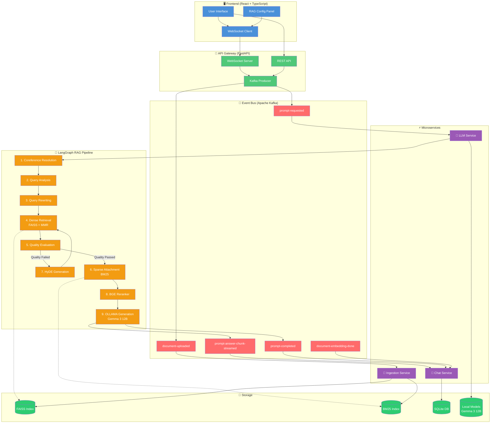
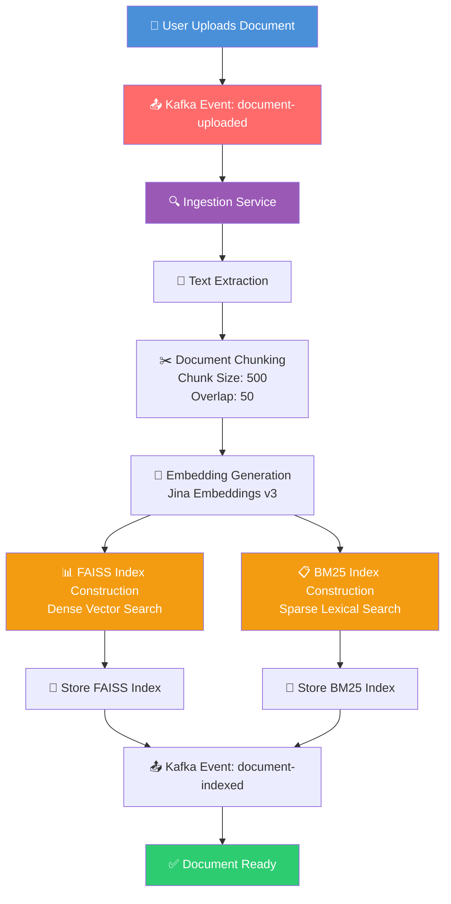
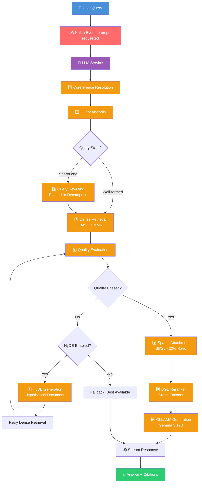

# ⚡ Adaptive Event-Driven RAG System with Hybrid Retrieval running on Local LLM Models

**An Adaptive Event-Driven RAG System with Hybrid Retrieval (FAISS + MMR + BM25 + BGE Reranker + HyDE) using Event-Driven Architecture (Microservices with Kafka Message Broker) running on Local LLM Models (OLLAMA)**

[](https://www.python.org/)
[](https://fastapi.tiangolo.com/)
[](https://langchain-ai.github.io/langgraph/)
[](https://github.com/facebookresearch/faiss)
[](#)
[](https://github.com/FlagOpen/FlagEmbedding)
[](#)
[](https://kafka.apache.org/)
[](#)
[](https://ollama.com/)
[](https://reactjs.org/)
[](https://www.docker.com/)
[](LICENSE)

---

## 📖 Table of Contents

- [Introduction](#introduction)
- [Overview](#overview)
- [Key Features](#key-features)
- [System Architecture](#system-architecture)
- [Knowledge Base Construction Pipeline](#knowledge-base-construction-pipeline)
- [Adaptive Conversational Retrieval Pipeline](#adaptive-conversational-retrieval-pipeline)
- [Technology Stack](#technology-stack)
- [Project Structure](#project-structure)
- [Quick Start](#quick-start)
- [Configuration](#configuration)
- [API Endpoints](#api-endpoints)
- [WebSocket Streaming](#websocket-streaming)
- [Event Flow](#event-flow)
- [Privacy & Security](#privacy--security)
- [Troubleshooting](#troubleshooting)
- [License](#license)
- [Acknowledgements](#acknowledgements)

---

## 📖 Introduction

One of the most valuable capabilities language models have brought to organizations is reading documents through AI and using it to automate responses. **RAG (Retrieval-Augmented Generation)** is the most practical technique for this, allowing us to feed the latest documents to the system and retrieve them based on user queries using dense vector search, sparse vector search, reranking, and other methods before passing them to the LLM.

While many resources explain RAG well, most use APIs and are not local, which is a concern for organizations with confidential documents. Another issue is that their code is usually limited to a Python notebook, lacking a real chatbot product perspective.

**This project solves both problems.**

This is a **production-ready, end-to-end RAG chatbot** that:
- ✅ Runs **100% locally** with OLLAMA (Gemma 3 12B)
- ✅ No external API calls - complete **data privacy**
- ✅ Full **chatbot experience** with React frontend and WebSocket streaming
- ✅ **Document upload** support (PDF, DOCX, TXT, Markdown)
- ✅ **Hybrid retrieval** with FAISS + BM25 + BGE Reranker
- ✅ **Adaptive pipeline** using LangGraph orchestration
- ✅ **Event-driven architecture** with Kafka microservices
- ✅ **Real-time streaming** with character-by-character responses
- ✅ **Source citations** with filename and page numbers

Gemma 3 12B proves highly effective for RAG, delivering strong retrieval and generation quality while maintaining full data privacy and cost efficiency. The system retrieves the most relevant chunks and generates accurate responses with references to source files and page numbers.

---

## 📖 Overview

This project presents an **adaptive Retrieval-Augmented Generation (RAG)** framework designed for scalable, privacy-preserving conversational AI.

Unlike traditional RAG pipelines that rely on a fixed retrieval strategy, this system dynamically adapts its retrieval workflow based on query complexity and retrieval quality. By combining **dense semantic search**, **sparse lexical search**, **adaptive query transformation**, and **cross-encoder reranking**, the system delivers highly relevant context for local Large Language Models (LLMs).

The architecture follows an **event-driven microservices design**, where independent services communicate asynchronously through **Apache Kafka**, enabling scalable document ingestion, distributed processing, and real-time response generation.

Since all AI models run locally through **OLLAMA** with **Gemma 3 12B**, the entire pipeline operates without external API calls, ensuring complete data privacy and eliminating cloud inference costs.

---

## ✨ Key Features

### 📚 Document Processing
- Upload PDF, DOCX, TXT and Markdown documents
- Automatic text extraction using PyMuPDF
- Intelligent document chunking with overlap
- Metadata extraction and tracking
- Incremental document indexing
- Document status tracking (pending → indexing → completed → failed)

### 🔍 Adaptive Hybrid Retrieval
- **Dense Retrieval** - Semantic search using FAISS with Jina Embeddings v3
- **MMR (Maximum Marginal Relevance)** - Diversity-enhanced retrieval
- **Sparse Retrieval** - Lexical keyword matching using BM25
- **Hybrid Retrieval** - Combined Dense + Sparse with configurable ratio
- **Adaptive Query Rewriting** - Short query expansion and long query decomposition
- **Quality Evaluation** - Automatic assessment of retrieval quality
- **HyDE (Hypothetical Document Embeddings)** - Query transformation for better retrieval
- **Cross-Encoder Reranking** - BGE-Reranker v2 for precision scoring
- **Coreference Resolution** - Pronoun resolution using conversation history

### 🤖 Local AI Models (OLLAMA)
- **Gemma 3 12B** - High-quality, capable responses
- **Local Embedding Models** - Jina Embeddings v3
- **Local Reranker** - BGE Reranker v2-m3
- **Fully Offline** - No external API calls

### ⚡ Event-Driven Architecture
- **Apache Kafka** - Reliable message broker
- **Independent Microservices** - Decoupled, scalable services
- **Asynchronous Processing** - Non-blocking event streams
- **Fault Tolerance** - Service isolation
- **Horizontal Scalability** - Scale services independently

### 💬 Modern Chat Experience
- **React + TypeScript UI** - Modern, responsive interface
- **Real-time WebSocket Streaming** - Live token-by-token responses
- **Character-by-Character Streaming** - True typing effect with configurable delays
- **Multi-document Conversations** - Select multiple documents per conversation
- **Persistent Chat History** - SQLite database storage
- **Source Attribution** - Citations with filename and page numbers
- **RAG Configuration Panel** - Real-time parameter adjustment via UI

### 🔒 Privacy First
- ✅ **100% Local** - No external API calls
- ✅ **Zero Cloud Costs** - No per-token or per-request fees
- ✅ **Air-Gap Ready** - Works in isolated environments
- ✅ **Data Sovereignty** - Complete control over your data
- ✅ **No Data Leakage** - Documents never leave your infrastructure

---

## 🏗️ System Architecture



---

## 📚 Knowledge Base Construction Pipeline

This pipeline handles document ingestion and indexing for search.



### Pipeline Stages

| Stage | Component | Description |
|-------|-----------|-------------|
| 1 | **Document Upload** | User uploads PDF, DOCX, TXT, or Markdown |
| 2 | **Kafka Event** | `document-uploaded` event published |
| 3 | **Ingestion Service** | Consumer processes the document |
| 4 | **Text Extraction** | Extract text using PyMuPDF |
| 5 | **Document Chunking** | Split into 500-char chunks with 50-char overlap |
| 6 | **Embedding Generation** | Convert chunks to vectors via Jina v3 |
| 7 | **FAISS Index** | Build dense vector index for semantic search |
| 8 | **BM25 Index** | Build sparse lexical index for keyword search |
| 9 | **Knowledge Base** | Both indexes ready for retrieval |

---

## 💬 Adaptive Conversational Retrieval Pipeline

This pipeline handles user queries and generates responses using **Gemma 3 12B**.



### Pipeline Stages

| # | Node | Description | Input | Output |
|---|------|-------------|-------|--------|
| 1 | **Coreference Resolution** | Resolves pronouns using conversation history | Query + History | Resolved Query |
| 2 | **Query Analysis** | Analyzes query length and complexity | Resolved Query | Query State |
| 3 | **Query Rewriting** | Expands short or decomposes long queries | Query + State | Rewritten Queries |
| 4 | **Dense Retrieval** | FAISS similarity search with MMR | Query | Dense Chunks |
| 5 | **Quality Evaluation** | Checks if documents meet threshold | Dense Chunks | Quality Pass/Fail |
| 6 | **Sparse Attachment** | Attaches BM25 results (if quality passes) | Query | Combined Chunks |
| 7 | **HyDE Generation** | Generates hypothetical document (fallback) | Query | HyDE Document |
| 8 | **Reranking** | BGE cross-encoder reranking | Combined Chunks | Ranked Chunks |
| 9 | **Generation** | OLLAMA (Gemma 3 12B) answer with citations | Ranked Chunks | Answer |

---

## 🛠 Technology Stack

| Component | Technology | Role |
|-----------|------------|------|
| **Orchestration** | LangGraph | Pipeline orchestration & state management |
| **Message Broker** | Apache Kafka | Async event communication |
| **LLM** | OLLAMA (Gemma 3 12B) | Text generation + HyDE |
| **Query Transform** | HyDE | Hypothetical Document Embeddings |
| **Dense Search** | FAISS + MMR | Semantic retrieval with diversity |
| **Sparse Search** | BM25 | Lexical keyword matching |
| **Reranker** | BGE Reranker v2 | Cross-encoder precision |
| **Embeddings** | Jina AI v3 | Dense vector encoding |
| **Coreference** | Custom LLM | Pronoun resolution |
| **Query Rewriting** | LLM-based | Query expansion/decomposition |
| **Backend** | Python 3.11 + FastAPI | Kafka producers/consumers |
| **Frontend** | React + TypeScript | Modern UI |
| **WebSocket** | FastAPI WebSockets | Real-time streaming |
| **Database** | SQLite | Conversation storage |
| **Orchestration** | Docker Compose | Container management |
| **Monitoring** | Kafdrop | Kafka UI |

---

## 📂 Project Structure

```
adaptive-RAG/
│
├── backend/
│   ├── services/
│   │   ├── chat-service/
│   │   │   ├── Dockerfile
│   │   │   ├── Dockerfile-worker
│   │   │   └── src/
│   │   │       ├── api/
│   │   │       │   ├── routes/
│   │   │       │   │   ├── conversation_routes.py
│   │   │       │   │   ├── document_routes.py
│   │   │       │   │   └── websocket_routes.py
│   │   │       │   ├── schemas/
│   │   │       │   │   ├── conversation_schemas.py
│   │   │       │   │   └── document_schemas.py
│   │   │       │   └── websocket/
│   │   │       │       └── manager.py
│   │   │       ├── consumers/
│   │   │       │   └── chat_consumer.py
│   │   │       ├── database/
│   │   │       │   ├── models.py
│   │   │       │   └── sqlite_session.py
│   │   │       ├── handlers/
│   │   │       │   ├── document_embedding_done_handler.py
│   │   │       │   ├── prompt_answer_chunk_streamed_handler.py
│   │   │       │   └── prompt_answer_completed_handler.py
│   │   │       ├── services/
│   │   │       │   ├── conversation_service.py
│   │   │       │   └── document_service.py
│   │   │       ├── workers/
│   │   │       │   └── worker.py
│   │   │       ├── dependencies.py
│   │   │       ├── main.py
│   │   │       └── registry.py
│   │   │
│   │   └── llm-service/
│   │       ├── Dockerfile
│   │       └── src/
│   │           ├── graph/
│   │           │   ├── orchestrator_graph.py
│   │           │   ├── orchestrator_nodes.py
│   │           │   └── orchestrator_state.py
│   │           ├── handlers/
│   │           │   ├── document_uploaded_handler.py
│   │           │   └── prompt_requested_graph_handler.py
│   │           ├── services/
│   │           │   ├── core/
│   │           │   │   ├── document_loader.py
│   │           │   │   ├── embedding_model.py
│   │           │   │   ├── jina_wrapper.py
│   │           │   │   ├── text_chunker.py
│   │           │   │   └── text_preprocessor.py
│   │           │   ├── coreference_resolver.py
│   │           │   ├── generation_service.py
│   │           │   ├── hyde_service.py
│   │           │   ├── ingestion_service.py
│   │           │   ├── llm_service.py
│   │           │   ├── query_rewriting_service.py
│   │           │   ├── query_state.py
│   │           │   ├── reranker.py
│   │           │   └── retrieval_service.py
│   │           ├── workers/
│   │           │   └── worker.py
│   │           ├── dependencies.py
│   │           ├── main.py
│   │           └── registry.py
│   │
│   └── shared/
│       ├── common/
│       │   ├── events/
│       │   │   ├── base_event.py
│       │   │   ├── document_embedding_done.py
│       │   │   ├── document_uploaded.py
│       │   │   ├── prompt_answer_chunk_streamed.py
│       │   │   ├── prompt_answer_completed.py
│       │   │   └── prompt_answer_requested.py
│       │   ├── kafka/
│       │   │   ├── consumer.py
│       │   │   └── producer.py
│       │   └── message_bus/
│       │       ├── bus.py
│       │       └── interfaces.py
│       ├── requirements.txt
│       ├── setup.py
│       └── README.md
│
├── frontend/
│   └── rag-react-app/
│       ├── src/
│       ├── public/
│       └── package.json
│
├── models/
│   ├── snapshot/
│   │   └── jina-embeddings-v3/
│   ├── BAAI/
│   │   └── models--BAAI--bge-reranker-v2-m3/
│   ├── faiss_index/
│   ├── bm25_index/
│   └── hf_cache/
│
├── data/
│   ├── uploads/
│   ├── faiss_index/
│   └── bm25_index/
│
├── docker-compose.yml
├── .env.example
├── .gitignore
├── README.md
└── requirements.txt
```

---

## 🚀 Quick Start

### Prerequisites

- Docker & Docker Compose
- [OLLAMA](https://ollama.com/) installed locally
- Make sure ports 8001, 3000, 9092, 9000 are available

### 1. Install OLLAMA

```bash
# Download from https://ollama.com/
# Or install via command line
curl -fsSL https://ollama.com/install.sh | sh
```

### 2. Download Gemma 3 12B Model

```bash
ollama pull gemma3:12b
```

### 3. Start OLLAMA Service

```bash
ollama serve
```

### 4. Clone and Start Services

```bash
git clone https://github.com/yourusername/adaptive-rag.git
cd adaptive-rag

docker-compose up -d --build
```

### 5. Access the Application

| Service | URL |
|---------|-----|
| **Frontend** | http://localhost:3000 |
| **Chat Service API** | http://localhost:8001 |
| **API Documentation** | http://localhost:8001/docs |
| **Kafka UI (Kafdrop)** | http://localhost:9000 |

---

## ⚙️ Configuration

### RAG Configuration via WebSocket (UI)

All RAG parameters are passed from the UI via WebSocket messages. The frontend sends these parameters with each chat message, allowing per-query configuration.

#### Default Values (Sent from UI)

| Parameter | Default | Description |
|-----------|---------|-------------|
| `retrieval_k` | 20 | Number of candidates for initial retrieval |
| `similarity_threshold` | 0.5 | Score threshold for quality evaluation |
| `min_docs_required` | 3 | Minimum docs above threshold to pass quality |
| `top_k` | 5 | Number of final results after reranking |
| `use_hyde` | True | Enable HyDE fallback for poor quality |
| `sparse_ratio` | 0.2 | Ratio of BM25 results (20%) |
| `retrieval_total_k` | 20 | Total k for combined results |
| `use_reranker` | True | Enable BGE reranker |
| `use_mmr` | True | Enable MMR for diversity |
| `mmr_fetch_k` | 200 | Number of candidates for MMR |
| `mmr_lambda_mult` | 0.8 | MMR diversity vs relevance balance |

### WebSocket Chat Message Example

```json
{
    "type": "chat",
    "conversation_id": "abc-123",
    "prompt": "What is RAG?",
    "file_ids": ["doc-1", "doc-2"],
    "retrieval_k": 20,
    "similarity_threshold": 0.5,
    "min_docs_required": 3,
    "top_k": 5,
    "use_hyde": true,
    "sparse_ratio": 0.2,
    "retrieval_total_k": 20,
    "use_reranker": true,
    "use_mmr": true,
    "mmr_fetch_k": 200,
    "mmr_lambda_mult": 0.8
}
```

### UI Controls

The React frontend provides a RAG configuration panel where users can adjust these parameters in real-time:

- **Retrieval K** - Number of candidate chunks (1-100)
- **Similarity Threshold** - Quality threshold (0-1)
- **Top K** - Final results count (1-20)
- **HyDE** - Toggle on/off
- **MMR** - Toggle on/off
- **MMR Lambda** - Diversity slider (0-1)

### MMR Lambda Values (Controlled by UI)

| Lambda | Meaning | Use Case |
|--------|---------|----------|
| **0.3** | High diversity | Broad topics, exploratory search |
| **0.5** | Balanced | Default for most cases |
| **0.7** | High relevance | Specific fact-finding |
| **0.8** | Very high relevance | Focused, specific queries |

### HyDE (Controlled by UI)

| Setting | When to Use |
|---------|-------------|
| `use_hyde: true` | Short queries (1-3 words), ambiguous or technical queries |
| `use_hyde: false` | Long, well-formed questions, low latency requirements |

### WebSocket Response with Config

```json
{
    "type": "ack",
    "conversation_id": "abc-123",
    "dialogue_id": "def-456",
    "file_ids": ["doc-1", "doc-2"],
    "config": {
        "retrieval_k": 20,
        "similarity_threshold": 0.5,
        "top_k": 5,
        "use_hyde": true,
        "use_mmr": true,
        "mmr_lambda_mult": 0.8
    },
    "timestamp": "2024-01-01T12:00:00.000Z"
}
```

---

## 🌐 API Endpoints

### Conversations

| Method | Endpoint | Description |
|--------|----------|-------------|
| POST | `/conversation/new` | Create a new conversation |
| GET | `/conversation/user/{user_id}` | Get user conversations |
| GET | `/conversation/{conversation_id}` | Get conversation details |
| DELETE | `/conversation/{conversation_id}` | Delete a conversation |

### Documents

| Method | Endpoint | Description |
|--------|----------|-------------|
| POST | `/documents/upload` | Upload a document |
| GET | `/documents/` | Get all documents |
| DELETE | `/documents/{document_id}` | Delete a document |

### Health

| Method | Endpoint | Description |
|--------|----------|-------------|
| GET | `/health` | Service health check |

### WebSocket

| Endpoint | Description |
|----------|-------------|
| `/ws/{user_id}` | WebSocket connection for real-time chat |

---

## 🔌 WebSocket Streaming

### Connection

```
ws://localhost:8001/ws/{user_id}
```

### Sending a Chat Message

```json
{
    "type": "chat",
    "conversation_id": "abc-123",
    "prompt": "What is RAG?",
    "file_ids": ["doc-1", "doc-2"],
    "retrieval_k": 20,
    "similarity_threshold": 0.5,
    "top_k": 5,
    "use_hyde": true,
    "use_mmr": true,
    "mmr_lambda_mult": 0.8
}
```

### Receiving a Chunk

```json
{
    "type": "answer_chunk",
    "chunk": "RAG stands for ",
    "chunk_index": 0,
    "is_last": false
}
```

### Receiving Completion

```json
{
    "type": "answer",
    "conversation_id": "abc-123",
    "answer": "RAG stands for Retrieval Augmented Generation..."
}
```

---

## 🔄 Event Flow

### Document Ingestion

```
Upload → Gateway → Kafka → Ingestion Service → Chunking → 
Embedding → FAISS + BM25 → Kafka → Chat Service → Database
```

### User Request

```
User → Gateway → Kafka → LLM Service → LangGraph Pipeline → 
Retrieval → Reranker → OLLAMA (Gemma 3 12B) → Kafka → Chat Service → WebSocket → User
```

---

## 🔒 Privacy & Security

- ✅ **100% Local Inference** - All models run locally
- ✅ **Zero External API Calls** - No data sent to external services
- ✅ **Air-Gap Ready** - Works in isolated environments
- ✅ **Data Sovereignty** - Complete control over all data
- ✅ **No Cloud Costs** - No per-token fees

---

## 🐛 Troubleshooting

### OLLAMA Connection Error
```bash
# Check OLLAMA is running
ollama ps
# Restart OLLAMA
ollama serve
# Test connection
curl http://localhost:11434/api/tags
```

### Model Not Found
```bash
# Pull the model
ollama pull gemma3:12b
```

### Kafka Not Starting
```bash
docker-compose logs kafka
docker-compose restart kafka
```

### WebSocket Connection Failed
```bash
# Check WebSocket endpoint
curl -i -N -H "Connection: Upgrade" -H "Upgrade: websocket" http://localhost:8001/ws/test
```

---

## 📄 License

MIT License

---

## 🙏 Acknowledgements

- [OLLAMA](https://ollama.com/) - Local LLM inference (Gemma 3)
- [Google DeepMind](https://deepmind.google/) - Gemma 3 12B model
- [LangGraph](https://langchain-ai.github.io/langgraph/) - Pipeline orchestration
- [Jina AI](https://jina.ai/) - Embedding models
- [BAAI](https://www.baai.ac.cn/) - BGE Reranker
- [FAISS](https://github.com/facebookresearch/faiss) - Vector search
- [Apache Kafka](https://kafka.apache.org/) - Event streaming
- [FastAPI](https://fastapi.tiangolo.com/) - API framework
- [React](https://reactjs.org/) - UI framework

---

