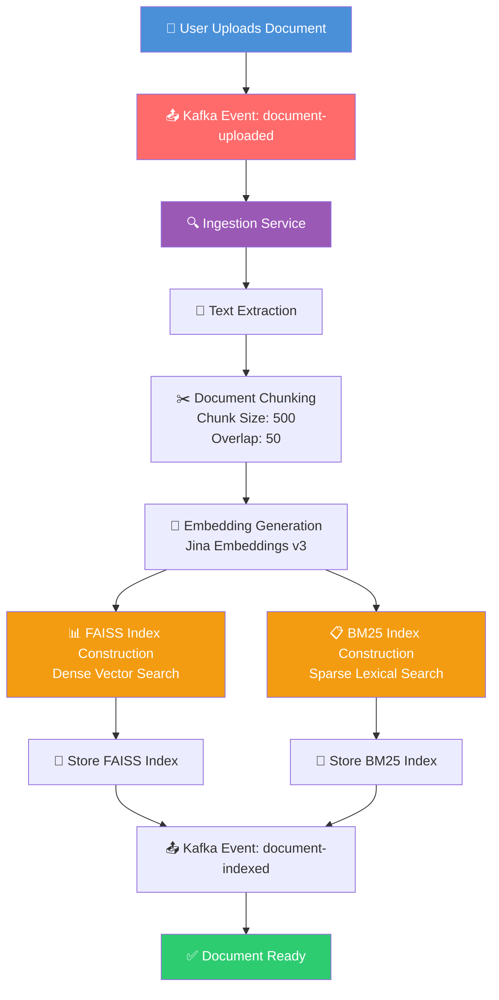
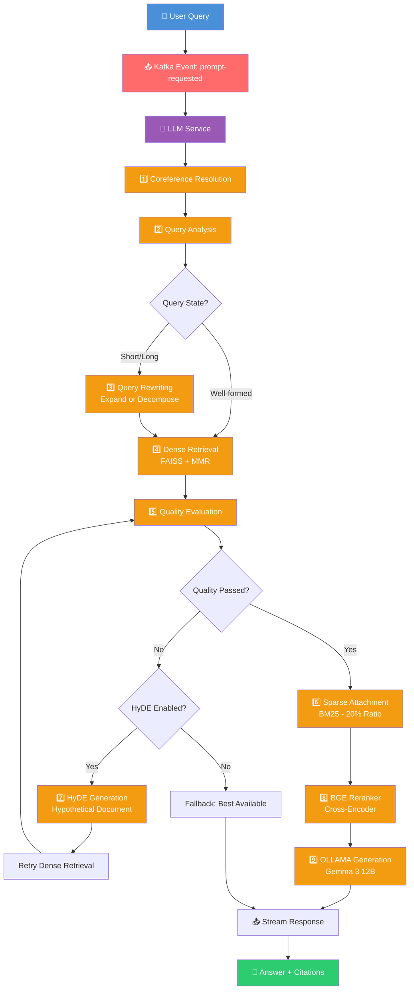

# ⚡ Adaptive Event-Driven RAG System with Hybrid Retrieval running on Local LLM Models

**An Adaptive Event-Driven RAG System with Hybrid Retrieval (FAISS + MMR + BM25 + BGE Reranker + HyDE) using Event-Driven Architecture (Microservices with Kafka Message Broker) running on Local LLM Models (OLLAMA)**

[](https://www.python.org/)
[](https://fastapi.tiangolo.com/)
[](https://langchain-ai.github.io/langgraph/)
[](https://github.com/facebookresearch/faiss)
[](#)
[](https://github.com/FlagOpen/FlagEmbedding)
[](#)
[](https://kafka.apache.org/)
[](#)
[](https://ollama.com/)
[](https://reactjs.org/)
[](https://www.docker.com/)
[](LICENSE)

---

## 📖 Introduction

One of the most valuable capabilities language models have brought to organizations is reading documents through AI and using it to automate responses. **RAG (Retrieval-Augmented Generation)** is the most practical technique for this, allowing us to feed the latest documents to the system and retrieve them based on user queries using dense vector search, sparse vector search, reranking, and other methods before passing them to the LLM.

While many resources explain RAG well, most use APIs and are not local, which is a concern for organizations with confidential documents. Another issue is that their code is usually limited to a Python notebook, lacking a real chatbot product perspective.

**This project solves both problems.**

This is a **production-ready, end-to-end RAG chatbot** that:
- ✅ Runs **100% locally** with OLLAMA (Gemma 3 12B)
- ✅ No external API calls - complete **data privacy**
- ✅ Full **chatbot experience** with React frontend and WebSocket streaming
- ✅ **Document upload** support (PDF, DOCX, TXT, Markdown)
- ✅ **Hybrid retrieval** with FAISS + BM25 + BGE Reranker
- ✅ **Adaptive pipeline** using LangGraph orchestration
- ✅ **Event-driven architecture** with Kafka microservices
- ✅ **Real-time streaming** with character-by-character responses
- ✅ **Source citations** with filename and page numbers

Although Gemma 3 12B's parameter size is modest compared to larger commercial models, it has shown acceptable performance for RAG tasks. This is because the system's primary responsibility is generation based on retrieved context, where the heavy lifting of retrieval and relevance ranking is handled by the hybrid retrieval pipeline. The model only needs to synthesize and articulate the provided information, a task that 12B parameter models handle effectively.

---

## 📖 Overview

This project presents an **adaptive Retrieval-Augmented Generation (RAG)** framework designed for scalable, privacy-preserving conversational AI.

Unlike traditional RAG pipelines that rely on a fixed retrieval strategy, this system dynamically adapts its retrieval workflow based on query complexity and retrieval quality. By combining **dense semantic search**, **sparse lexical search**, **adaptive query transformation**, and **cross-encoder reranking**, the system delivers highly relevant context for local Large Language Models (LLMs).

The architecture follows an **event-driven microservices design**, where independent services communicate asynchronously through **Apache Kafka**, enabling scalable document ingestion, distributed processing, and real-time response generation.

Since all AI models run locally through **OLLAMA** with **Gemma 3 12B**, the entire pipeline operates without external API calls, ensuring complete data privacy and eliminating cloud inference costs.

---

## ✨ Key Features

### 📚 Document Processing
- Upload PDF, DOCX, TXT and Markdown documents
- Automatic text extraction
- Intelligent document chunking with overlap
- Document status tracking (pending → indexing → completed → failed)

### 🔍 Adaptive Hybrid Retrieval
- **Dense Retrieval** - FAISS with Jina Embeddings v3
- **MMR (Maximum Marginal Relevance)** - Diversity-enhanced retrieval
- **Sparse Retrieval** - BM25 keyword matching
- **Hybrid Retrieval** - Combined Dense + Sparse with configurable ratio
- **Quality Evaluation** - Automatic assessment of retrieval quality
- **HyDE** - Query transformation for better retrieval
- **BGE Reranker** - Cross-encoder precision scoring
- **Coreference Resolution** - Pronoun resolution using conversation history

### 🤖 Local AI Models (OLLAMA)
- **Gemma 3 12B** - Sufficient for RAG generation tasks
- **Jina Embeddings v3** - Local embedding models
- **BGE Reranker v2-m3** - Local cross-encoder
- **Fully Offline** - No external API calls

### ⚡ Event-Driven Architecture
- **Apache Kafka** - Reliable message broker
- **Independent Microservices** - Decoupled, scalable services
- **Asynchronous Processing** - Non-blocking event streams
- **Fault Tolerance** - Service isolation

### 💬 Modern Chat Experience
- **React + TypeScript UI** - Modern, responsive interface
- **Real-time WebSocket Streaming** - Live token-by-token responses
- **Character-by-Character Streaming** - True typing effect
- **Multi-document Conversations** - Select multiple documents
- **Persistent Chat History** - SQLite database storage
- **Source Attribution** - Citations with filename and page numbers
- **RAG Configuration Panel** - Real-time parameter adjustment via UI

### 🔒 Privacy First
- ✅ **100% Local** - No external API calls
- ✅ **Zero Cloud Costs** - No per-token or per-request fees
- ✅ **Air-Gap Ready** - Works in isolated environments
- ✅ **Data Sovereignty** - Complete control over your data
- ✅ **No Data Leakage** - Documents never leave your infrastructure

---

## 📚 Knowledge Base Construction Pipeline



### Pipeline Stages

| Stage | Component | Description |
|-------|-----------|-------------|
| 1 | **Document Upload** | User uploads PDF, DOCX, TXT, or Markdown |
| 2 | **Kafka Event** | `document-uploaded` event published |
| 3 | **Ingestion Service** | Consumer processes the document |
| 4 | **Text Extraction** | Extract text using PyMuPDF |
| 5 | **Document Chunking** | Split into 500-char chunks with 50-char overlap |
| 6 | **Embedding Generation** | Convert chunks to vectors via Jina v3 |
| 7 | **FAISS Index** | Build dense vector index for semantic search |
| 8 | **BM25 Index** | Build sparse lexical index for keyword search |
| 9 | **Knowledge Base** | Both indexes ready for retrieval |

---

## 💬 Adaptive Conversational Retrieval Pipeline



### Pipeline Stages

| # | Node | Description |
|---|------|-------------|
| 1 | **Coreference Resolution** | Resolves pronouns using conversation history |
| 2 | **Query Analysis** | Analyzes query length and complexity |
| 3 | **Query Rewriting** | Expands short or decomposes long queries |
| 4 | **Dense Retrieval** | FAISS similarity search with MMR |
| 5 | **Quality Evaluation** | Checks if documents meet threshold |
| 6 | **Sparse Attachment** | Attaches BM25 results (if quality passes) |
| 7 | **HyDE Generation** | Generates hypothetical document (fallback) |
| 8 | **Reranking** | BGE cross-encoder reranking |
| 9 | **Generation** | OLLAMA (Gemma 3 12B) answer with citations |

---

## 🛠 Technology Stack

| Component | Technology | Role |
|-----------|------------|------|
| **Orchestration** | LangGraph | Pipeline orchestration & state management |
| **Message Broker** | Apache Kafka | Async event communication |
| **LLM** | OLLAMA (Gemma 3 12B) | Text generation + HyDE |
| **Dense Search** | FAISS + MMR | Semantic retrieval with diversity |
| **Sparse Search** | BM25 | Lexical keyword matching |
| **Reranker** | BGE Reranker v2 | Cross-encoder precision |
| **Embeddings** | Jina AI v3 | Dense vector encoding |
| **Backend** | Python 3.11 + FastAPI | Kafka producers/consumers |
| **Frontend** | React + TypeScript | Modern UI |
| **WebSocket** | FastAPI WebSockets | Real-time streaming |
| **Database** | SQLite | Conversation storage |
| **Orchestration** | Docker Compose | Container management |

---

## 📂 Project Structure

```
adaptive-RAG/
│
├── backend/
│   ├── services/
│   │   ├── chat-service/
│   │   └── llm-service/
│   └── shared/
│
├── frontend/
│   └── rag-react-app/
│
├── models/
│   ├── snapshot/jina-embeddings-v3/
│   ├── BAAI/models--BAAI--bge-reranker-v2-m3/
│   ├── faiss_index/
│   ├── bm25_index/
│   └── hf_cache/
│
├── data/
│   ├── uploads/
│   ├── faiss_index/
│   └── bm25_index/
│
├── docker-compose.yml
├── .env.example
├── .gitignore
├── README.md
└── requirements.txt
```

---

## 🚀 Quick Start

### Prerequisites

- Docker & Docker Compose
- [OLLAMA](https://ollama.com/) installed locally
- Ports 8001, 3000, 9092, 9000 available

### 1. Install OLLAMA

```bash
# Download from https://ollama.com/
curl -fsSL https://ollama.com/install.sh | sh
```

### 2. Download Gemma 3 12B Model

```bash
ollama pull gemma3:12b
```

### 3. Start OLLAMA Service

```bash
ollama serve
```

### 4. Clone and Start Services

```bash
git clone https://github.com/yourusername/adaptive-rag.git
cd adaptive-rag

docker-compose up -d --build
```

### 5. Access the Application

| Service | URL |
|---------|-----|
| **Frontend** | http://localhost:3000 |
| **Chat Service API** | http://localhost:8001 |
| **Kafka UI (Kafdrop)** | http://localhost:9000 |

---

## ⚙️ Configuration

### RAG Configuration via WebSocket (UI)

All RAG parameters are passed from the UI via WebSocket messages, allowing per-query configuration.

| Parameter | Default | Description |
|-----------|---------|-------------|
| `retrieval_k` | 20 | Number of candidates for initial retrieval |
| `similarity_threshold` | 0.5 | Score threshold for quality evaluation |
| `min_docs_required` | 3 | Minimum docs above threshold |
| `top_k` | 5 | Number of final results |
| `use_hyde` | True | Enable HyDE fallback |
| `sparse_ratio` | 0.2 | Ratio of BM25 results (20%) |
| `use_mmr` | True | Enable MMR for diversity |
| `mmr_lambda_mult` | 0.8 | MMR diversity vs relevance balance |

### MMR Lambda Values

| Lambda | Meaning |
|--------|---------|
| **0.3** | High diversity |
| **0.5** | Balanced |
| **0.7** | High relevance |
| **0.8** | Very high relevance |

---

## 🔌 WebSocket Streaming

### Sending a Chat Message

```json
{
    "type": "chat",
    "conversation_id": "abc-123",
    "prompt": "What is RAG?",
    "file_ids": ["doc-1", "doc-2"],
    "retrieval_k": 20,
    "similarity_threshold": 0.5,
    "top_k": 5,
    "use_hyde": true,
    "use_mmr": true,
    "mmr_lambda_mult": 0.8
}
```

### Receiving a Chunk

```json
{
    "type": "answer_chunk",
    "chunk": "RAG stands for ",
    "chunk_index": 0,
    "is_last": false
}
```

---

## 🔄 Event Flow

### Document Ingestion

```
Upload → Gateway → Kafka → Ingestion Service → Chunking → 
Embedding → FAISS + BM25 → Kafka → Chat Service → Database
```

### User Request

```
User → Gateway → Kafka → LLM Service → LangGraph Pipeline → 
Retrieval → Reranker → OLLAMA → Kafka → Chat Service → WebSocket → User
```

---

## 🔒 Privacy & Security

- ✅ **100% Local Inference** - All models run locally
- ✅ **Zero External API Calls** - No data sent to external services
- ✅ **Air-Gap Ready** - Works in isolated environments
- ✅ **Data Sovereignty** - Complete control over all data
- ✅ **No Cloud Costs** - No per-token fees

---

## 🐛 Troubleshooting

### OLLAMA Not Working

**Issue:** OLLAMA connection error or model not found.

**Check if OLLAMA is running:**
```bash
ollama ps
```

**Start OLLAMA:**
```bash
ollama serve
```

**Test connection from container:**
```bash
docker exec rag-llm-service curl -s http://host.docker.internal:11434/api/tags
```

**If connection fails:**
- On Windows/macOS: Ensure `host.docker.internal` resolves correctly
- On Linux: Use `172.17.0.1` instead of `host.docker.internal`
- Check OLLAMA is listening on all interfaces: `OLLAMA_HOST=0.0.0.0 ollama serve`

**Pull the model if missing:**
```bash
ollama pull gemma3:12b
```

### Kafka Not Starting

```bash
docker-compose logs kafka
docker-compose restart kafka
```

---

## 📄 License

MIT License

---

## 🙏 Acknowledgements

- [OLLAMA](https://ollama.com/) - Local LLM inference
- [Google DeepMind](https://deepmind.google/) - Gemma 3 12B
- [LangGraph](https://langchain-ai.github.io/langgraph/) - Pipeline orchestration
- [Jina AI](https://jina.ai/) - Embedding models
- [BAAI](https://www.baai.ac.cn/) - BGE Reranker
- [FAISS](https://github.com/facebookresearch/faiss) - Vector search
- [Apache Kafka](https://kafka.apache.org/) - Event streaming
- [FastAPI](https://fastapi.tiangolo.com/) - API framework

---
